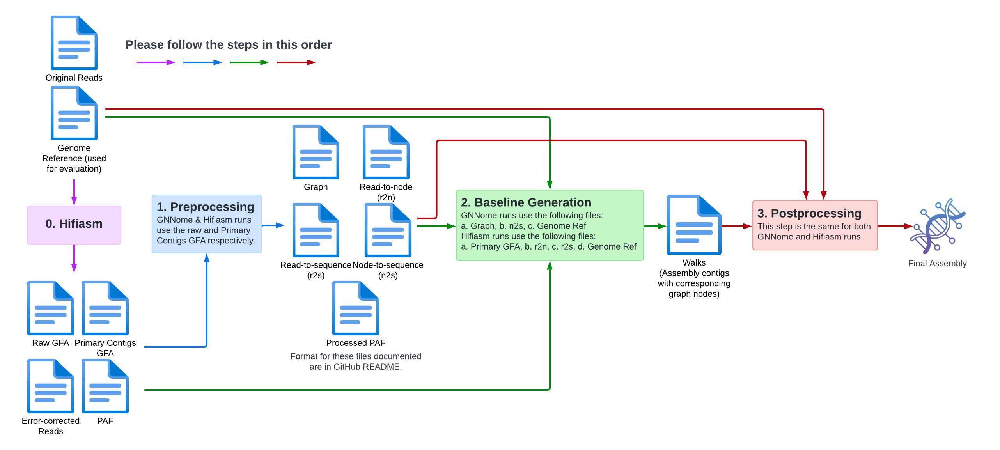

# GAP
GAP = Genome Assembly Postprocessor :-)

## How To Use
To run, please setup config.yaml, then run main.py. Instructions to setup config.yaml are commented in the file. 

### Architecture
The codebase is split into three main functions:
1. <b>Pre-processing:</b> Processes the GFA, PAF and Error-Corrected Reads FASTA into the relevant files needed for the other steps. If it is a Hifiasm run, the GFA file should be the primary contigs (.p_ctg.gfa) file. If it is a GNNome run, the GFA file should be the raw (.bp.raw.r_utg.gfa) file.
2. <b>Baseline Generation:</b> Generates the baseline assembly as well as the walks, which are the graph nodes corresponding to the assembly's contigs.
3. <b>Postprocessing:</b> Runs the postprocessing step as outlined in \<paper name here>. This postprocessing step can be run as a standalone if you wish to generate your own input files. Please see the [File Formats](#file-formats) section for relevant info.

<p align="center">
  
  <i>GAP Repo Architecture.</i>
</p>

### Input/Output Files
<table>
  <tr>
    <th style="width: 75px;">Function</th>
    <th style="width: 250px;">Input Files</th>
    <th style="width: 250px;">Output Files</th>
  </tr>
  <tr>
    <td>Preprocessing</td>
    <td>- GFA file <br>- PAF file <br>- EC Reads FASTA</td>
    <td>- Graph <br>- Node-to-sequence (n2s) <br>- Read-to-node (r2n) <br>- Read-to-sequence (r2s) <br>- Processed PAF <br></td>
  </tr>
  <tr>
    <td>Baseline Generation</td>
    <td>
    <b>For GNNome</b><br>
    - Graph <br>- Node-to-sequence (n2s) <br>- Genome Reference<br><br>
    <b>For Hifiasm</b><br>
    - GFA file <br>- Read-to-node (r2n) <br>- Read-to-sequence (r2s) <br>- Genome Reference<br>
    </td>
    <td>- Baseline walks & assembly</td>
  </tr>
  <tr>
    <td>Postprocessing</td>
    <td>- Contigs <br>- Graph <br>- Node-to-sequence (n2s) <br>- Read-to-node (r2n) <br>- Read-to-sequence (r2s) <br>- Processed PAF <br>- Genome Reference</td>
    <td>- Final assembly</td>
  </tr>
</table>

### File Formats
```
Graph: DGL Graph object. It is important that for each node with node_id, the node with its reverse complement is node_id+1. Additionally, the graph has:
- Node features: ['N_ID', 'read_length']
- Edge features: ['E_ID', 'prefix_length', 'overlap_length', 'overlap_similarity']

n2s: {
    node_id (int) : sequence (str)
}

r2n : {
    read_id (str) : (real_node_id, virtual_node_id) (tuple<int, int>)
}

r2s : {
    read_id (str) : (sequence, reverse comp) (tuple<str, str>)
}

Processed PAF: {
    ghost_edges = {
        'valid_src' : [node_id_1, ...] source nodes (list<int>),
        'valid_dst' : [node_id_2, ...] destination nodes (list<int>),
        'ol_len' : [overlap_length_1, ...] respective overlap lengths (list<int>),
        'ol_similarity' : [overlap_similarity_1, ...] respective overlap similarities (list<int>),
        'prefix_len' : [prefix_length_1, ...] respective prefix lengths (list<int>),
        'edge_hops' : [hop_neighbourhood_1, ...] respective edge hops (list<int>)
    },
    ghost_nodes = {
        'hop_<n>' {
            '+' : {
                read_id : {
                    'read_len' : Read length for this read
                    'outs' : [read_id, ...]
                    'ol_len_outs' : [ol_len, ...],
                    'ol_similarity_outs' : [ol_similarity, ...],
                    'prefix_len_outs' : [prefix_len, ...],
                    'ins' : [read_id, ...],
                    'ol_len_ins' : [ol_len, ...],
                    'ol_similarity_ins' : [ol_similarity, ...],
                    'prefix_len_ins' : [prefix_len, ...],
                }, 
                read_id_2 : { ... },
                ...
            },
            '-' : { ... }
        },
        'hop_<n+1>' : { ... }
    }
}
```

## Directory
The codebase is split into the three main functions, each with their respective directory.

    - main.py  		      Main script to run.
    - config.yaml                 Configs to be set. Ensure that the genome you are running has its info in the specified format.
    - preprocess/             
        - preprocess.py           Main script to run the various pre-processing steps.
        - gfa_util.py             Script to pre-process GFA file.
        - fasta_util.py           Script to pre-process error-corrected reads FASTA file.
        - paf_util.py             Script to pre-process PAF file.
    - generate_baseline/
        - generate_baseline.py    Main script to generate the baseline walks and assembly.
        - hifiasm_decoding.py     Generates baseline from Hifiasm's final GFA.
        - gnnome_decoding.py      Generates baseline from GNNome's graph. Basic version of GNNome's decoding step.
        - SymGatedGCN.py          SymGatedGCN layer from GNNome.
    - postprocess/
        - postprocess.py          Script for postprocessing pipeline.
